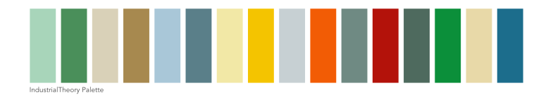
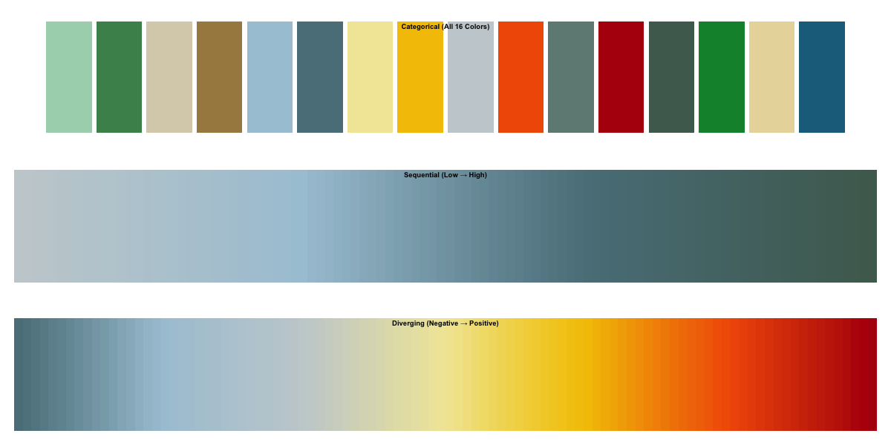

# industrialTheory Color Palette 🎨

A reusable industrial color palette for R focused on functional, safety-informed color design.
This palette is inspired by industrial safety color systems:

- **Reds / Oranges** → alerts & hazards  
- **Yellows** → attention & visibility  
- **Greens / Blues** → safety & information  
- **Grays / Buffs** → neutral background structure  




## Selected Colors

|Name            |Hex      |
|:---------------|:--------|
| light_green    | #A8D5BA |
| medium_green   | #4A8F5A |
| beige          | #D9D1B8 |
| sandalwood     | #A7894F |
| light_blue     | #A9C7D8 |
| medium_blue    | #5A7F89 |
| soft_yellow    | #F2E8A6 |
| solar_yellow   | #F4C400 |
| light_gray     | #C7D0D3 |
| alert_orange   | #F25C05 |
| medium_gray    | #6F8A83 |
| fire_red       | #B3120A |
| deep_gray      | #4E6A5E |
| safety_green   | #0B8F3A |
| spotlight_buff | #E8D9A8 |
| caution_blue   | #1C6D8C |

## Install

```r
remotes::install_github("naddo/industrialTheory")
```

## Usage

```r
library(industrialTheory)

# Get palette
industrial_pal(5)

# Diverging palette
industrial_pal(7, type = "diverging")

# ggplot
library(ggplot2)

ggplot(mtcars, aes(factor(cyl), fill = factor(cyl))) +
  geom_bar() +
  scale_fill_industrial()
```

## Preview


```r
# show_industrial()

# See additional Formats
preview_industrial()
```

Designed for clarity

© 2026 @naddo